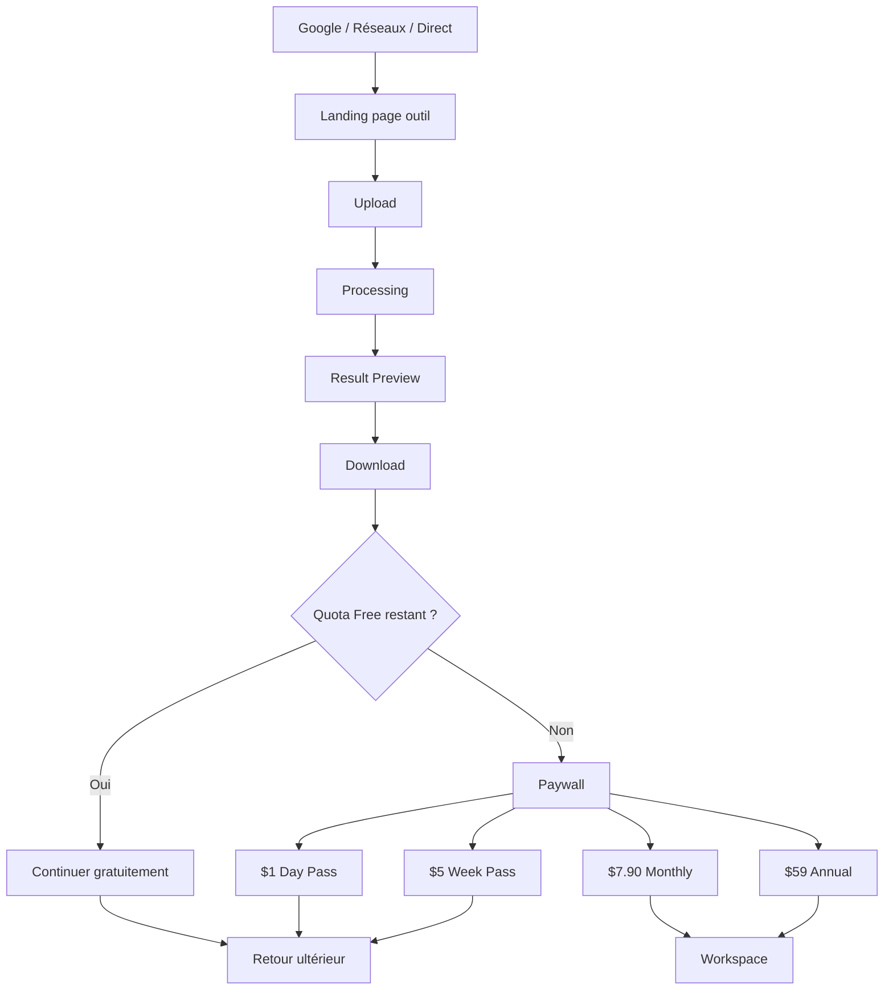
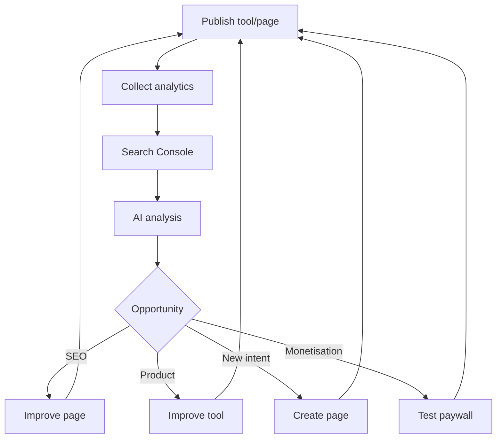

# Master Strategy & Product Specification
## SaaS documentaire / PDF — Next.js
### Version 1.0 — Stratégie solo founder + IA

---

# 0. Objectif du document

Ce document définit la stratégie complète, l’architecture produit, l’architecture technique, le modèle économique, le funnel, le système SEO et le mode d’exécution d’un SaaS documentaire moderne inspiré des meilleures pratiques observées chez des acteurs comme iLovePDF, Smallpdf et Zendocs, tout en étant pensé pour être construit et opéré par **une seule personne assistée par l’IA**.

Le but n’est pas de créer un simple clone d’un convertisseur PDF.

Le but est de construire une **machine de distribution + conversion + rétention** :

```text
SEO / contenu / bouche-à-oreille
            ↓
Landing pages orientées intention
            ↓
Outil immédiatement utilisable
            ↓
Valeur délivrée avant friction
            ↓
Email / compte
            ↓
Free → Day Pass → Week Pass → Pro
            ↓
Workspace
            ↓
Retour utilisateur
            ↓
Données produit + Search Console
            ↓
IA
            ↓
Nouvelles pages / nouveaux outils / optimisation
```

La stratégie combine quatre idées :

1. **iLovePDF** : acquisition organique, outils gratuits, faible friction.
2. **Zendocs** : funnel industrialisé, pages par intention, design system, analytics.
3. **Smallpdf** : workspace, rétention, suite documentaire, fonctionnalités avancées.
4. **Sejda-like pricing logic** : paiement ponctuel pour utilisateurs occasionnels.

---

# 1. Vision

## 1.1. Proposition de valeur

Créer une plateforme documentaire en ligne extrêmement simple permettant de :

- compresser des PDF ;
- fusionner des PDF ;
- diviser des PDF ;
- convertir PDF ↔ images ;
- convertir PDF ↔ documents Office ;
- protéger / déverrouiller des PDF ;
- signer des PDF ;
- manipuler des pages ;
- faire de l’OCR ;
- extraire du texte ;
- plus tard : traduire, résumer, analyser et discuter avec des documents.

Le produit doit être utile avant même que l’utilisateur crée un compte.

## 1.2. Positionnement

Le produit ne doit pas être présenté comme :

> “Une suite de gestion documentaire complexe.”

Mais plutôt comme :

> “Le moyen le plus simple de résoudre immédiatement un problème de document.”

Le produit doit répondre à une intention précise.

Exemples :

```text
Je veux compresser un PDF.
Je veux fusionner deux PDF.
Je veux convertir une image en PDF.
Je veux signer un document.
Je veux réduire un PDF pour l’envoyer par email.
```

Chaque intention doit correspondre à une page dédiée.

## 1.3. Principe fondateur

La landing page est le produit.

Pas :

```text
Google → article → CTA → produit
```

Mais :

```text
Google → page SEO → upload → résultat
```

---

# 2. Positionnement stratégique

## 2.1. Ce que l’on reprend d’iLovePDF

- outils gratuits faciles d’accès ;
- vitesse ;
- simplicité ;
- SEO programmatique mais utile ;
- langues multiples ;
- maillage interne ;
- chaque outil dispose de sa propre page ;
- marque basée sur la répétition d’usage.

## 2.2. Ce que l’on reprend de Zendocs

- architecture par archétypes de pages ;
- funnel partagé ;
- même moteur pour de nombreux outils ;
- instrumentation analytics dès le départ ;
- pages construites à partir de données, pas du code dupliqué ;
- design system exploitable par l’IA ;
- industrialisation des variantes ;
- amélioration centralisée : une modification améliore tout le catalogue.

## 2.3. Ce que l’on reprend de Smallpdf

- workspace ;
- historique ;
- documents récents ;
- usage multi-outils ;
- expérience premium cohérente ;
- fonctionnalités avancées ;
- compte utilisateur ;
- plus tard : Business / Teams.

## 2.4. Ce que l’on ne copie pas

Ne pas copier :

- paywalls trompeurs ;
- renouvellements cachés ;
- pricing ambigu ;
- dizaines de fonctionnalités avant validation ;
- contenu SEO inutile ;
- pages dupliquées en masse ;
- dépendance initiale à Google Ads ;
- architecture frontend différente par outil.

---

# 3. Business model

## 3.1. Plans

### Free

Prix :

```text
$0
```

Proposition :

- 3 traitements gratuits par jour ;
- fichiers jusqu’à 25 MB ;
- traitement standard ;
- 1 fichier à la fois ;
- compression standard ;
- historique limité ou absent ;
- outils principaux disponibles ;
- fichiers supprimés automatiquement après une courte durée.

Objectif du Free :

- acquisition ;
- SEO ;
- bouche-à-oreille ;
- démonstration de valeur ;
- collecte de données ;
- déclenchement des upgrades.

---

### Day Pass

Prix cible :

```text
$1 / 24 heures
```

Caractéristiques :

- paiement unique ;
- aucun renouvellement automatique ;
- accès aux outils premium ;
- limites de taille supérieures ;
- traitement batch modéré ;
- priorité supérieure ;
- historique temporaire.

Message clé :

> One-time payment. No subscription.

Objectif :

Monétiser l’utilisateur occasionnel qui refuse l’abonnement.

---

### Week Pass

Prix cible :

```text
$5 / 7 jours
```

Caractéristiques :

- paiement unique ;
- aucun renouvellement automatique ;
- accès premium complet pendant 7 jours ;
- batch processing ;
- fichiers plus volumineux ;
- outils avancés.

Objectif :

- projets ponctuels ;
- dossiers administratifs ;
- candidatures ;
- opérations de masse sur quelques jours ;
- servir aussi d’ancre tarifaire.

---

### Pro

Prix cible :

```text
$7.90 / mois
```

Caractéristiques :

- renouvellement mensuel explicite ;
- annulation simple ;
- plus grandes limites ;
- batch ;
- OCR ;
- signature ;
- historique ;
- workspace ;
- priorité ;
- stockage temporaire ou long terme selon stratégie ;
- outils avancés.

---

### Pro Annual

Prix cible :

```text
$59 / an
```

Équivalent :

```text
$4.92 / mois
```

Objectif :

- cash upfront ;
- réduire churn ;
- renforcer rétention ;
- meilleure valeur perçue.

---

## 3.2. Logique tarifaire

```text
Free       → essayer
$1 Day     → urgence
$5 Week    → projet ponctuel
$7.90 Mo   → usage fréquent
$59 Year   → usage régulier / meilleure valeur
```

Le Week Pass doit rendre le Monthly plus attractif :

```text
$5 pour 7 jours
vs
$7.90 pour environ 30 jours
```

---

# 4. Funnel principal

## 4.1. Funnel recommandé



---

# 5. Stratégie email

## 5.1. Principe

Ne pas bloquer immédiatement l’utilisateur avant qu’il ait vu la valeur.

## 5.2. Variante recommandée au lancement

```text
Document 1:
Upload → Process → Download
Pas de compte

Document 2:
Upload → Process → Download
Pas de compte

Document 3:
Upload → Process → Email → Download
```

Cette variante doit être testée.

Alternative :

```text
Premier document :
Upload → Process → Preview → Email → Download
```

L’analytics doit décider.

## 5.3. Éviter

Éviter :

```text
Homepage → Create account → Verify email → Upload
```

Trop de friction.

---

# 6. Architecture SEO globale

## 6.1. Objectif initial

Construire un système permettant de publier :

```text
100+ URLs utiles
```

sans coder 100 pages.

Le système doit être capable de monter ensuite à :

```text
200
500
1000+
```

si les données justifient l’expansion.

---

# 7. Structure des 100 premières pages

## 7.1. Répartition cible

```text
32 outils EN
32 outils FR
12 guides EN
12 guides FR
6 templates EN
6 templates FR
----------------
100 URLs
```

Cette base peut être adaptée selon les performances.

---

# 8. Catalogue initial d’outils

## 8.1. Conversions

1. PDF to Word
2. Word to PDF
3. PDF to Excel
4. Excel to PDF
5. PDF to PowerPoint
6. PowerPoint to PDF
7. PDF to JPG
8. JPG to PDF
9. PDF to PNG
10. PNG to PDF
11. HEIC to JPG
12. HEIC to PNG

## 8.2. Manipulation

13. Merge PDF
14. Split PDF
15. Compress PDF
16. Compress Image
17. Rotate PDF
18. Delete PDF Pages
19. Extract PDF Pages
20. Reorder PDF Pages
21. Insert PDF Pages
22. Add Page Numbers

## 8.3. Sécurité / édition légère

23. Watermark PDF
24. Protect PDF
25. Unlock PDF
26. Sign PDF
27. Fill PDF
28. Add Text to PDF

## 8.4. OCR / IA

29. Image to Text
30. Scan to Text
31. PDF Translator
32. Audio / Video to Text

---

# 9. Outils de lancement

Ne pas développer les 32 immédiatement.

Commencer avec les moins coûteux et les plus simples.

Priorité V1 :

```text
Merge PDF
Split PDF
Compress PDF
JPG to PDF
PNG to PDF
PDF to JPG
Rotate PDF
Delete PDF Pages
Reorder PDF Pages
Watermark PDF
Protect PDF
Unlock PDF
```

Raison :

- forte utilité ;
- coûts faibles ;
- bibliothèques open-source disponibles ;
- peu d’IA payante ;
- faible complexité comparée à PDF → Word parfait.

---

# 10. Guides SEO

## 10.1. Exemples

- How to compress a PDF
- How to merge PDF files
- How to split a PDF
- How to password protect a PDF
- How to remove a PDF password
- How to convert images to PDF
- How to sign a PDF online
- How to reduce a PDF for email
- PDF won't upload or convert
- Supported file formats
- PDF security & privacy
- Scanned PDF vs normal PDF

## 10.2. Règle

Chaque guide doit :

- résoudre un problème réel ;
- apporter une réponse complète ;
- contenir des captures / schémas si utile ;
- pointer vers un outil ;
- éviter le bourrage de mots-clés ;
- être meilleur que les résultats déjà classés.

---

# 11. Long-tail SEO

Ne pas créer des centaines de pages uniquement pour remplacer un mot.

Mauvais exemple :

```text
compress-pdf-to-1mb
compress-pdf-to-1-1mb
compress-pdf-to-1-2mb
compress-pdf-fast
compress-pdf-small
```

si toutes les pages sont identiques.

Créer une page long-tail seulement si :

1. l’intention est réellement différente ;
2. le produit peut répondre différemment ;
3. le contenu est unique ;
4. Search Console montre une demande ;
5. l’utilisateur reçoit une vraie valeur additionnelle.

---

# 12. Exemples de pages long-tail valides

```text
/compress-pdf-for-email
/compress-pdf-without-losing-quality
/scanned-pdf-to-word
/pdf-to-word-on-iphone
/pdf-to-word-on-mac
/sign-pdf-on-iphone
/merge-pdf-on-android
```

Ces pages peuvent contenir :

- instructions spécifiques au device ;
- UX adaptée ;
- limitations spécifiques ;
- FAQ spécifique ;
- CTA vers le même moteur.

---

# 13. Internationalisation

## 13.1. Langues de départ

```text
English
French
```

## 13.2. Expansion future

```text
Spanish
Portuguese
Arabic
German
Italian
etc.
```

## 13.3. Structure d’URL

Option recommandée :

```text
/en/pdf-to-word
/fr/pdf-to-word
/es/pdf-to-word
/pt/pdf-to-word
```

Ou :

```text
/pdf-to-word
/fr/pdf-to-word
```

avec anglais en racine.

## 13.4. SEO international

Chaque locale doit disposer de :

- title traduit ;
- H1 traduit ;
- copy localisée ;
- FAQ localisée ;
- metadata ;
- `hreflang` ;
- canonical correct ;
- sitemap propre.

---

# 14. Architecture Next.js

## 14.1. Stack recommandée

Frontend + application :

```text
Next.js
TypeScript
React
Tailwind CSS
```

UI :

```text
shadcn/ui ou composants maison
Radix primitives si nécessaire
```

Validation :

```text
Zod
```

Forms :

```text
React Hook Form
```

Auth :

```text
Auth.js / Clerk / Supabase Auth
```

Base de données :

```text
PostgreSQL
```

ORM :

```text
Drizzle ORM ou Prisma
```

Stockage :

```text
Cloudflare R2
ou
AWS S3
```

Queue :

```text
Redis + BullMQ
```

Workers :

```text
Node.js workers
ou
service Python séparé
```

Analytics :

```text
PostHog
ou
Mixpanel
```

Payments :

```text
Stripe
```

Email :

```text
Resend
```

Monitoring :

```text
Sentry
```

---

# 15. Architecture de repository

```text
/
├── app/
│   ├── [locale]/
│   │   ├── page.tsx
│   │   ├── tools/
│   │   │   └── [slug]/
│   │   │       └── page.tsx
│   │   ├── guides/
│   │   │   └── [slug]/
│   │   │       └── page.tsx
│   │   ├── templates/
│   │   │   └── [slug]/
│   │   │       └── page.tsx
│   │   ├── pricing/
│   │   ├── dashboard/
│   │   ├── login/
│   │   └── account/
│   │
│   └── api/
│       ├── upload/
│       ├── jobs/
│       ├── billing/
│       ├── webhooks/
│       └── auth/
│
├── components/
│   ├── uploader/
│   ├── tool/
│   ├── seo/
│   ├── pricing/
│   ├── dashboard/
│   └── shared/
│
├── content/
│   ├── tools/
│   ├── guides/
│   ├── templates/
│   └── locales/
│
├── lib/
│   ├── db/
│   ├── storage/
│   ├── queue/
│   ├── billing/
│   ├── auth/
│   ├── analytics/
│   └── seo/
│
├── processors/
│   ├── pdf/
│   ├── images/
│   ├── office/
│   └── ocr/
│
├── workers/
│   ├── process-document.ts
│   └── cleanup.ts
│
├── docs/
│   ├── PRODUCT.md
│   ├── DESIGN_SYSTEM.md
│   ├── PAGE_ARCHETYPES.md
│   ├── SEO_RULES.md
│   ├── COPY_RULES.md
│   ├── ANALYTICS.md
│   └── ARCHITECTURE.md
│
├── AGENTS.md
├── package.json
└── README.md
```

---

# 16. Architecture par archétypes

L’objectif est de ne pas créer une page React unique par outil.

## Archetype A — File Tool

Utilisé pour :

```text
Compress PDF
Merge PDF
Split PDF
PDF to JPG
JPG to PDF
Protect PDF
Unlock PDF
```

Sections :

```text
Hero
Uploader
Processing states
Result
Trust / security
How it works
Benefits
Use cases
Related tools
FAQ
```

## Archetype B — AI / Text Tool

Utilisé pour :

```text
OCR
Translator
Audio to Text
Document summarizer
```

Sections :

```text
Hero
Input
Processing
Result
Examples
Benefits
Supported formats
Limits
FAQ
Related tools
```

## Archetype C — Template / Generator

Utilisé pour :

```text
Invoice
Quotation
Purchase Order
Meeting Minutes
Recommendation Letter
```

Sections :

```text
Hero
Template preview
Form fields
Generate button
Use cases
How it works
FAQ
Related templates
```

---

# 17. Catalogue de pages piloté par données

Exemple :

```ts
export type ToolDefinition = {
  slug: string;
  locale: string;
  category: "convert" | "compress" | "edit" | "security" | "ocr";
  archetype: "file" | "ai" | "template";

  seo: {
    title: string;
    description: string;
    h1: string;
    canonical?: string;
  };

  ui: {
    headline: string;
    subtitle: string;
    uploadLabel: string;
    acceptedTypes: string[];
    maxFileSizeMB: number;
  };

  processor: {
    id: string;
    inputTypes: string[];
    outputType: string;
  };

  content: {
    intro: string;
    benefits: string[];
    useCases: string[];
    faq: {
      question: string;
      answer: string;
    }[];
  };

  related: string[];
};
```

---

# 18. Exemple de définition outil

```ts
export const pdfToJpg = {
  slug: "pdf-to-jpg",
  category: "convert",
  archetype: "file",

  seo: {
    title: "PDF to JPG Converter – Convert PDF Pages Online",
    description:
      "Convert PDF pages into high-quality JPG images online.",
    h1: "Convert PDF to JPG"
  },

  ui: {
    headline: "Convert PDF pages to JPG",
    subtitle: "Fast, secure and easy to use.",
    uploadLabel: "Select PDF",
    acceptedTypes: ["application/pdf"],
    maxFileSizeMB: 25
  },

  processor: {
    id: "pdf_to_jpg",
    inputTypes: ["pdf"],
    outputType: "zip"
  },

  content: {
    intro: "...",
    benefits: [],
    useCases: [],
    faq: []
  },

  related: [
    "jpg-to-pdf",
    "pdf-to-png",
    "compress-pdf"
  ]
};
```

---

# 19. Route dynamique

Exemple conceptuel :

```tsx
export default async function ToolPage({
  params
}: {
  params: Promise<{ locale: string; slug: string }>;
}) {
  const { locale, slug } = await params;

  const tool = await getTool(locale, slug);

  if (!tool) {
    notFound();
  }

  return <FileToolPage tool={tool} />;
}
```

Une seule page peut donc produire des dizaines d’URLs.

---

# 20. Static generation

Utiliser `generateStaticParams()` lorsque pertinent.

Objectif :

- pages SEO pré-rendues ;
- temps de réponse rapide ;
- meilleure indexabilité ;
- faible coût.

Exemple :

```tsx
export async function generateStaticParams() {
  return getAllTools().map(tool => ({
    locale: tool.locale,
    slug: tool.slug
  }));
}
```

---

# 21. Metadata dynamique

```tsx
export async function generateMetadata({ params }) {
  const { locale, slug } = await params;
  const tool = await getTool(locale, slug);

  return {
    title: tool.seo.title,
    description: tool.seo.description,
    alternates: {
      canonical: tool.seo.canonical
    }
  };
}
```

---

# 22. Structured data

Chaque page outil peut inclure des schémas comme :

```text
SoftwareApplication
WebApplication
FAQPage
BreadcrumbList
```

Les guides :

```text
Article
HowTo
FAQPage
```

Les templates :

```text
CreativeWork
WebApplication
FAQPage
```

Ne pas ajouter du structured data non conforme uniquement pour obtenir des rich snippets.

---

# 23. Sitemap

Créer :

```text
/sitemap.xml
```

ou plusieurs sitemaps :

```text
/sitemap-tools.xml
/sitemap-guides.xml
/sitemap-templates.xml
```

Le sitemap doit être généré à partir du catalogue de contenu.

---

# 24. Robots.txt

Autoriser les pages publiques utiles.

Bloquer :

```text
/dashboard
/account
/internal
/api
/temp
/downloads privés
```

selon besoin.

---

# 25. Backend / processing

## 25.1. Principe

Ne pas faire un endpoint différent avec logique complète pour chaque outil.

Créer :

```text
POST /api/jobs
```

Payload :

```json
{
  "tool": "compress-pdf",
  "fileId": "file_123"
}
```

Réponse :

```json
{
  "jobId": "job_456",
  "status": "queued"
}
```

---

# 26. Processor Registry

Exemple :

```ts
const PROCESSORS = {
  "merge-pdf": mergePdf,
  "split-pdf": splitPdf,
  "compress-pdf": compressPdf,
  "pdf-to-jpg": pdfToJpg,
  "jpg-to-pdf": jpgToPdf,
  "protect-pdf": protectPdf,
  "unlock-pdf": unlockPdf
};
```

Le worker charge :

```text
job.tool
```

puis résout automatiquement le processor.

---

# 27. Workflow d’un job


---

# 28. États d’un job

```text
pending
uploaded
queued
processing
completed
failed
expired
deleted
```

---

# 29. Modèle de données

## users

```text
id
email
name
email_verified
created_at
updated_at
```

## files

```text
id
user_id nullable
original_name
mime_type
size_bytes
storage_key
status
created_at
expires_at
```

## jobs

```text
id
user_id nullable
tool_slug
input_file_id
output_file_id nullable
status
error_code nullable
created_at
started_at
completed_at
expires_at
```

## subscriptions

```text
id
user_id
provider
provider_subscription_id
plan
status
current_period_start
current_period_end
cancel_at_period_end
```

## passes

```text
id
user_id
type
starts_at
ends_at
payment_id
status
```

## usage

```text
id
user_id nullable
anonymous_id nullable
tool_slug
date
jobs_count
```

## payments

```text
id
user_id
provider
provider_payment_id
amount
currency
type
status
created_at
```

---

# 30. Utilisateurs anonymes

Le Free doit fonctionner sans compte.

Créer un identifiant anonyme :

```text
anon_id
```

stocké en cookie sécurisé.

Le quota peut être calculé avec :

- cookie ;
- IP hash ;
- device fingerprint léger si nécessaire ;
- compte lorsqu’il existe.

Éviter un fingerprinting intrusif.

---

# 31. Quotas

## Free

```text
3 jobs / 24h
25 MB max/file
1 file concurrent
standard priority
```

## Day Pass

```text
higher quota
100 MB max/file
batch support
priority medium
```

## Week Pass

```text
higher quota
100–200 MB
batch
priority
```

## Pro

```text
high quota
200 MB+
batch
priority
history
advanced tools
```

Éviter d’utiliser le mot “unlimited” si des limites techniques réelles existent.

---

# 32. Upload strategy

Ne pas envoyer les gros fichiers au serveur Next.js directement si évitable.

Utiliser :

```text
Client
↓
Signed URL
↓
Cloudflare R2 / S3
```

Puis créer le job.

Avantages :

- moins de bande passante serveur ;
- meilleure stabilité ;
- meilleure montée en charge ;
- moins de risques de timeout.

---

# 33. File security

Principes :

- signed URLs ;
- expiration ;
- noms de fichiers non prédictibles ;
- stockage privé ;
- MIME validation ;
- magic-byte validation ;
- taille maximale ;
- antivirus si nécessaire ;
- suppression automatique ;
- isolation entre utilisateurs.

---

# 34. Privacy promise

Proposition marketing possible :

> Your files are automatically deleted after processing.

Mais uniquement si techniquement vrai.

Exemple :

```text
Free → suppression sous 2h
Pass → suppression sous 24h
Pro → configurable ou historique
```

---

# 35. PDF processing technologies

Possibilités :

```text
qpdf
Ghostscript
PDFium
MuPDF
PyMuPDF
pdf-lib
LibreOffice headless
ImageMagick
Tesseract
PaddleOCR
```

Ne pas choisir une seule technologie pour tous les outils.

Créer une abstraction par processor.

---

# 36. Séparer web app et processing

Next.js doit gérer :

- pages ;
- auth ;
- billing ;
- metadata ;
- dashboard ;
- API orchestration.

Les traitements lourds doivent être exécutés par workers.

Architecture :

```text
Next.js
  ↓
Queue
  ↓
Workers
  ↓
R2/S3
```

---

# 37. Node vs Python workers

## Node.js

Avantages :

- un seul langage ;
- moins de complexité ;
- pdf-lib ;
- Sharp ;
- bon pour traitements légers.

## Python

Avantages :

- OCR ;
- PyMuPDF ;
- traitement documentaire avancé ;
- meilleure richesse de bibliothèques.

Stratégie recommandée :

```text
Next.js = app principale
Node workers = tâches simples
Python worker = conversion / OCR avancé
```

Mais commencer simple.

---

# 38. Paiements

Stripe au lancement si disponible pour la structure juridique choisie.

Products :

```text
day_pass
week_pass
pro_monthly
pro_annual
```

Day / Week :

```text
one-time payment
```

Pro :

```text
subscription
```

---

# 39. Billing UX

Afficher clairement :

```text
$1 — 24 hours — One-time payment
$5 — 7 days — One-time payment
$7.90 — Monthly — Renews monthly
$59 — Annual — Renews yearly
```

Aucun texte ambigu.

---

# 40. Webhooks

Événements essentiels :

```text
checkout.session.completed
payment_intent.succeeded
payment_intent.failed
customer.subscription.created
customer.subscription.updated
customer.subscription.deleted
invoice.paid
invoice.payment_failed
```

Le backend doit être idempotent.

---

# 41. Analytics

Événements minimum :

```text
landing_viewed
upload_clicked
upload_started
upload_completed
job_created
job_processing_started
job_completed
job_failed
result_viewed
download_clicked
email_gate_viewed
email_submitted
quota_reached
paywall_viewed
plan_selected
checkout_started
purchase_completed
purchase_failed
workspace_viewed
return_1d
return_7d
return_30d
subscription_cancelled
refund_requested
```

---

# 42. Dimensions analytics

Chaque événement doit inclure si possible :

```text
tool_slug
locale
device_type
traffic_source
utm_source
utm_medium
utm_campaign
anonymous_or_logged_in
plan
file_size_bucket
processing_duration_bucket
success_or_failure
```

Ne jamais envoyer le contenu du document dans l’analytics.

---

# 43. Funnel metrics

Exemple :

```text
Landing Views
↓
Upload Starts
↓
Upload Complete
↓
Job Complete
↓
Result Viewed
↓
Download
↓
Email
↓
Paywall
↓
Checkout
↓
Paid
```

Calculer :

```text
upload rate
processing success rate
download rate
email capture rate
paywall conversion
checkout conversion
paid conversion
return rate
churn
```

---

# 44. North Star Metrics

Phase early :

```text
Successful document jobs / week
```

Phase monetisation :

```text
Paid users
MRR
Revenue per 1000 visitors
```

Phase SEO :

```text
Organic clicks
Indexed pages
Top 10 keywords
Non-brand traffic
```

---

# 45. Search Console feedback loop

Chaque semaine :

1. exporter les requêtes ;
2. identifier pages à impressions fortes ;
3. identifier CTR faible ;
4. identifier positions 8–20 ;
5. identifier nouvelles intentions ;
6. améliorer contenu ;
7. créer de nouvelles pages uniquement si utile.

---

# 46. IA comme équipe SEO

Entrées :

```text
Search Console
PostHog
catalogue des outils
pages existantes
backlog
```

Sorties demandées :

```text
pages à optimiser
nouveaux clusters
FAQ à enrichir
internal links
titles à tester
intentions non couvertes
pages inutiles à fusionner
```

L’IA recommande.

Le fondateur décide.

---

# 47. Internal linking

Chaque page doit inclure des outils liés.

Exemple :

```text
PDF to JPG
↓
JPG to PDF
PDF to PNG
Compress PDF
Merge PDF
```

Créer une matrice de relations.

Le maillage doit être contextuel.

---

# 48. Homepage

La homepage ne doit pas être un long storytelling.

Structure :

```text
Hero
Search / Tool picker
Most popular tools
All tools
Security
Why use us
Pricing teaser
FAQ
Footer
```

CTA principal :

```text
Choose a tool
```

ou accès direct aux outils populaires.

---

# 49. Tool page layout

```text
Header minimal
Breadcrumb
H1
Short promise
Uploader
Trust statement
Processing / result
How it works
Benefits
Use cases
FAQ
Related tools
Footer
```

L’uploader doit être visible sans scroll sur desktop.

---

# 50. Tool page mobile

Priorité mobile :

- uploader immédiatement visible ;
- zones tactiles larges ;
- drag & drop remplacé par file picker si nécessaire ;
- processing clair ;
- bouton download fixe ou évident ;
- pas de popups intrusifs.

---

# 51. Design system

Créer :

```text
/docs/DESIGN_SYSTEM.md
```

Définir :

## Foundations

- typography ;
- spacing ;
- border radius ;
- shadows ;
- colors ;
- iconography ;
- breakpoints.

## Components

- button ;
- uploader ;
- card ;
- modal ;
- input ;
- progress ;
- alert ;
- pricing card ;
- tabs ;
- dropdown ;
- toast.

## States

- default ;
- hover ;
- active ;
- disabled ;
- loading ;
- error ;
- success.

---

# 52. AI development rules

Créer :

```text
/AGENTS.md
```

Exemple de règles :

```text
1. Never create a new page layout when an existing archetype can be reused.
2. Never hardcode tool copy inside React components.
3. All public tool pages must be driven by ToolDefinition.
4. Reuse existing components before creating new ones.
5. Never duplicate processor logic.
6. Every new tool must include analytics events.
7. Every new public page must include metadata.
8. Every new locale must include hreflang.
9. Never store uploaded files permanently by default.
10. Never expose private storage URLs.
11. Add tests for every new processor.
12. Preserve mobile usability.
13. Prefer configuration over code duplication.
```

---

# 53. PRODUCT.md

Décrire :

- vision ;
- personas ;
- pricing ;
- quota ;
- funnel ;
- upgrade triggers ;
- features incluses ;
- non-goals.

---

# 54. SEO_RULES.md

Définir :

- title format ;
- description format ;
- H1 ;
- canonical ;
- hreflang ;
- schema ;
- minimum content quality ;
- duplicate content rules ;
- internal links ;
- index/noindex ;
- sitemap.

---

# 55. COPY_RULES.md

Ton :

```text
simple
direct
clear
non-manipulative
trustworthy
international
```

Éviter :

```text
"Best PDF tool in the universe"
"100% perfect"
"Unlimited" si faux
"Free forever" si limitation forte
```

---

# 56. Error UX

Exemples :

```text
This file is too large.
Your PDF appears to be corrupted.
This file type is not supported.
We couldn't process this file.
Your upload expired.
```

Toujours proposer :

```text
Try again
Choose another file
Use another related tool
```

---

# 57. Processing UX

États :

```text
Uploading…
Preparing your document…
Processing…
Almost done…
Ready to download
```

Afficher un vrai progrès lorsqu’il est mesurable.

Ne pas simuler arbitrairement une barre de progression trompeuse.

---

# 58. Result UX

Exemple compression :

```text
Original: 12.4 MB
Compressed: 3.1 MB
Saved: 75%
```

CTA :

```text
Download compressed PDF
```

Upsell discret :

```text
Need to process more files?
Day Pass / Week Pass / Pro
```

---

# 59. Paywall

Le paywall doit être contextuel.

Message :

```text
You’ve used your 3 free documents today.
Choose the access that fits your needs.
```

Options :

```text
$1 Day Pass
$5 Week Pass
$7.90 Pro
```

Mettre :

```text
One-time payment
```

sur Day/Week.

---

# 60. Upgrade triggers

Exemples :

```text
quota atteint
fichier > 25 MB
batch processing
OCR
advanced compression
priority
history
high-resolution output
```

Éviter de bloquer trop tôt les fonctionnalités essentielles.

---

# 61. Workspace

V1 :

```text
Recent documents
Recent jobs
Download results
Delete file
Billing
Plan
```

V2 :

```text
Folders
Favorites
Shared documents
Saved signatures
Templates
```

V3 :

```text
Teams
Roles
Audit logs
Approvals
```

---

# 62. Email capture

Possibilités :

- Magic link ;
- download link ;
- compte auto-créé ;
- code OTP.

Recommandation :

```text
Email → magic link
```

Évite mot de passe obligatoire.

---

# 63. Email lifecycle

Emails possibles :

```text
Your file is ready
Welcome
Your pass expires soon
Subscription receipt
Payment failed
Account security
```

Pas de spam.

---

# 64. Retention loops

Exemples :

```text
Recent tools
Last used tool
Saved files
Saved signature
History
Bookmark page
Email reminder
```

Le meilleur retention loop est le retour naturel :

> “J’ai encore un PDF à traiter.”

---

# 65. Referral

Plus tard :

```text
Invite a friend
Get extra free jobs
```

À tester uniquement après traction.

---

# 66. Security

Mesures minimum :

- HTTPS ;
- signed URLs ;
- private buckets ;
- file-type validation ;
- quotas ;
- rate limiting ;
- CSRF protections selon flows ;
- XSS protections ;
- sanitization ;
- secure cookies ;
- secret management ;
- dependency scanning ;
- audit logs pour billing.

---

# 67. Rate limiting

Limiter :

```text
upload
job creation
login
email magic links
checkout
```

Utiliser :

```text
Redis / Upstash
```

ou équivalent.

---

# 68. Abuse prevention

Risques :

- stockage abusif ;
- conversion massive ;
- bots ;
- uploads malveillants ;
- surcharge CPU ;
- scripts automatisés.

Solutions :

```text
quota
signed URLs
expiration
rate limits
captcha adaptatif
anonymous scoring
job concurrency
file size limits
```

---

# 69. Cleanup jobs

Worker périodique :

```text
find expired files
delete from storage
mark deleted
clean orphaned jobs
```

Ne jamais dépendre uniquement d’un cron fragile sans vérification.

---

# 70. Observability

Mesurer :

```text
queue depth
processing time
failure rate
CPU
memory
storage
bandwidth
job cost
payment errors
upload failures
```

---

# 71. Tests

## Unit tests

- processor registry ;
- quotas ;
- pricing ;
- metadata ;
- schemas.

## Integration tests

```text
upload → job → worker → result
```

## E2E

Avec Playwright :

```text
visit tool
upload fixture
wait result
download
quota
checkout
```

---

# 72. Fixtures

Créer des fichiers tests :

```text
small.pdf
large.pdf
encrypted.pdf
corrupted.pdf
single-page.pdf
multi-page.pdf
jpg.jpg
png.png
```

---

# 73. CI/CD

Pipeline :

```text
lint
typecheck
unit tests
integration tests
build
deploy preview
production
```

---

# 74. Déploiement

Option simple :

```text
Next.js → Vercel
Postgres → Neon / Supabase
R2 → Cloudflare
Redis → Upstash
Workers → Railway / Render / VPS
Email → Resend
Analytics → PostHog
```

Ne pas sur-architecturer au lancement.

---

# 75. Coûts

Objectif :

- domaine ;
- hébergement faible ;
- stockage pay-as-you-go ;
- workers modestes ;
- email free tier ;
- analytics free tier.

Le traitement de documents sera probablement le principal coût variable.

Suivre :

```text
cost per successful job
cost per paid user
gross margin
```

---

# 76. KPI économiques

Calculs essentiels :

```text
Conversion Free → Paid
Revenue per visitor
Revenue per 1000 organic visitors
ARPU
MRR
Churn
LTV
CAC
Gross Margin
Refund Rate
Chargeback Rate
```

---

# 77. SEO KPI

```text
Indexed URLs
Organic impressions
Organic clicks
CTR
Average position
Top 3 keywords
Top 10 keywords
Pages with zero clicks
Pages gaining impressions
Backlinks
Brand searches
```

---

# 78. Content lifecycle

Chaque page :

```text
Draft
Review
Published
Measured
Improved
Merged / redirected if weak
```

Une page n’est jamais “finie”.

---

# 79. Page pruning

Si après assez de temps une page :

- n’a aucune impression ;
- duplique une autre ;
- n’a aucune valeur ;
- ne reçoit aucun backlink ;
- ne sert pas le produit ;

alors :

```text
améliorer
fusionner
rediriger
ou noindex
```

---

# 80. Templates

Ne pas commencer par le juridique réglementé.

Premiers templates :

```text
Invoice
Quotation
Purchase Order
Expense Report
Recommendation Letter
Meeting Minutes
```

Chaque page template doit contenir :

```text
preview
fields
generator
download
FAQ
use cases
```

---

# 81. Programmatic SEO avec templates

Exemple :

```text
/invoice-template
/quotation-template
/purchase-order-template
```

Plus tard, variantes utiles :

```text
/invoice-template-for-freelancers
/invoice-template-for-consultants
```

uniquement si réelle différence de contenu / produit.

---

# 82. Localisation assistée par IA

Workflow :

```text
Source EN
↓
AI translation
↓
AI localization
↓
SEO metadata
↓
QA
↓
publish
```

Checklist :

- dates ;
- formats ;
- vocabulaire ;
- unités ;
- expressions ;
- mentions légales ;
- cohérence UI.

---

# 83. AI content guardrails

L’IA ne doit pas publier automatiquement sans validation.

Vérifier :

- factual accuracy ;
- duplicate content ;
- tone ;
- grammar ;
- promises ;
- legal claims ;
- security claims ;
- pricing ;
- output limits.

---

# 84. Roadmap

## Phase 0 — Foundation

Créer :

```text
Next.js project
Design system
AGENTS.md
PRODUCT.md
ARCHITECTURE.md
SEO_RULES.md
ToolDefinition schema
```

---

## Phase 1 — Core Engine

Construire :

```text
Uploader
R2/S3
Jobs
Queue
Worker
Result
Download
Expiration
Analytics
```

---

## Phase 2 — 5 outils

```text
Merge
Split
Compress
JPG to PDF
PDF to JPG
```

Objectif :

valider le moteur partagé.

---

## Phase 3 — 12 outils

Ajouter :

```text
PNG to PDF
Rotate PDF
Delete Pages
Reorder Pages
Watermark
Protect
Unlock
```

---

## Phase 4 — Public Launch

Ajouter :

```text
Homepage
Pricing
EN
FR
Analytics
Search Console
Sitemap
Robots
Structured data
```

---

## Phase 5 — Monetisation

Ajouter :

```text
3 free/day
$1 Day
$5 Week
$7.90 Monthly
$59 Annual
Stripe
Email gate
```

---

## Phase 6 — SEO Expansion

Construire :

```text
24 tool URLs
24+ guide URLs
internal linking
search console loop
```

---

## Phase 7 — 100+ URLs

Objectif :

```text
50 meaningful page concepts
×
2 locales
=
100 URLs
```

---

## Phase 8 — Advanced Tools

Ajouter progressivement :

```text
PDF to Word
Office conversions
OCR
Sign PDF
Fill PDF
Image to Text
```

---

## Phase 9 — Workspace

Ajouter :

```text
History
Files
Saved results
Billing
Saved signatures
```

---

## Phase 10 — Growth

Ajouter si données positives :

```text
Spanish
Portuguese
templates
referrals
Google Ads
retargeting
B2B
```

---

# 85. Priorité de travail solo founder

Toujours choisir :

```text
system > individual page
shared component > custom component
data > hardcoded content
processor registry > duplicate endpoint
real metrics > intuition
SEO demand > random feature
```

---

# 86. Sprints solo + IA

Exemple de sprint hebdomadaire :

## Jour 1

```text
Analyse analytics
Search Console
Priorisation
```

## Jour 2

```text
Feature / processor
```

## Jour 3

```text
Frontend / UX
```

## Jour 4

```text
SEO pages / content
```

## Jour 5

```text
Tests
Performance
Deploy
```

---

# 87. Utilisation de l’IA comme équipe

L’IA peut agir comme :

```text
Product analyst
Frontend engineer
Backend engineer
SEO assistant
QA assistant
Copywriter
Localization assistant
Data analyst
Security reviewer
```

Mais toi tu restes :

```text
Founder
Product owner
Architect
Final reviewer
Decision maker
```

---

# 88. Prompt système interne recommandé

Créer un prompt / fichier de règles indiquant :

```text
You are working on a document SaaS built with Next.js.

The product follows three page archetypes.
Never create duplicated page layouts.
All tools are configuration-driven.
All processors are registered centrally.
All SEO pages must provide real user value.
All user uploads are private by default.
Do not add subscriptions that are not explicitly described to the user.
Prefer simple solutions compatible with a solo founder.
Do not introduce infrastructure unless needed.
Preserve analytics on every funnel step.
```

---

# 89. Définition de “Done” pour un nouvel outil

Un outil n’est pas fini tant que :

- processor fonctionne ;
- input validation fonctionne ;
- output fonctionne ;
- erreurs gérées ;
- page EN existe ;
- page FR existe ;
- metadata existe ;
- analytics existe ;
- internal links existent ;
- quota fonctionne ;
- mobile testé ;
- E2E testé ;
- sitemap mis à jour ;
- documentation mise à jour.

---

# 90. Définition de “Done” pour une page SEO

- intention claire ;
- title unique ;
- H1 unique ;
- description unique ;
- produit utilisable ;
- contenu utile ;
- FAQ utile ;
- related tools ;
- canonical ;
- hreflang ;
- schema ;
- indexable ;
- mobile OK ;
- analytics.

---

# 91. Stratégie de backlink

Sans budget :

- Product Hunt ;
- Indie Hackers ;
- Reddit utile ;
- articles techniques ;
- outils gratuits ;
- pages statistiques ;
- guides de référence ;
- comparatifs honnêtes ;
- open-source libraries auxiliaires ;
- widgets embeddables plus tard.

Ne pas acheter des backlinks de mauvaise qualité.

---

# 92. Distribution hors SEO

Canaux gratuits :

```text
Reddit
Hacker News
Indie Hackers
LinkedIn
X
YouTube Shorts
TikTok
Facebook groups
WhatsApp / Telegram communities
```

Contenu :

```text
How to compress a PDF for email
How to sign a PDF on iPhone
How to merge PDFs for free
```

Lien direct vers l’outil.

---

# 93. Contenu vidéo

Format court :

```text
Problem
↓
Demonstration
↓
Result
↓
Tool link
```

Exemple :

> “Ton PDF fait 20 MB et Gmail refuse de l’envoyer ? Voilà comment le réduire en 10 secondes.”

---

# 94. Pourquoi cette stratégie est adaptée à un solo founder

Le levier vient de :

```text
1 moteur
1 design system
3 archétypes
12 processors
50 concepts de pages
2 locales
100 URLs
1 funnel
1 analytics
```

Le système réduit drastiquement le coût marginal d’une nouvelle page ou d’un nouvel outil.

---

# 95. Ce qui crée le moat

Le moat n’est pas seulement le code.

Le moat devient :

```text
SEO authority
brand
backlinks
tool catalog
processing reliability
historical data
user trust
analytics
conversion optimization
localization
workflow knowledge
```

---

# 96. Risques

## Risque 1 — SEO lent

Solution :

- outils gratuits ;
- contenu social ;
- lancement communautaire ;
- backlinks ;
- guides ;
- patience.

## Risque 2 — coûts processing

Solution :

- quotas ;
- workers optimisés ;
- cache si pertinent ;
- compression intelligente ;
- monitoring par outil.

## Risque 3 — utilisateurs gratuits uniquement

Solution :

- batch premium ;
- file size premium ;
- OCR premium ;
- passes ;
- workspace.

## Risque 4 — concurrence massive

Solution :

- meilleure UX ;
- prix transparent ;
- anglais + français ;
- vitesse ;
- niches ;
- long-tail ;
- trust.

## Risque 5 — trop construire

Solution :

- 5 outils d’abord ;
- données ;
- itération.

---

# 97. Non-goals V1

Ne pas construire immédiatement :

```text
full PDF editor
complex collaboration
enterprise SSO
advanced legal templates
AI chat
mobile native apps
desktop apps
50 languages
100 processors
```

---

# 98. Objectifs quantitatifs indicatifs

Phase 1 :

```text
100 successful jobs
```

Phase 2 :

```text
1,000 successful jobs
```

Phase 3 :

```text
1,000 organic visits/month
```

Phase 4 :

```text
10,000 organic visits/month
```

Phase 5 :

```text
first 100 paid users
```

Phase 6 :

```text
$1k MRR
```

Puis :

```text
$5k MRR
$10k MRR
```

Ne pas interpréter ces chiffres comme garantis.

---

# 99. Dashboard founder

Créer un dashboard interne montrant :

```text
Jobs today
Success rate
Failure rate
Organic visitors
Top tools
Top landing pages
Revenue
MRR
Day Pass sales
Week Pass sales
Monthly subscriptions
Annual subscriptions
Refunds
Queue depth
Storage usage
```

---

# 100. Tableau de décision produit

Avant de développer une fonctionnalité, lui donner une note :

```text
Search demand
User pain
Revenue potential
Implementation cost
Server cost
SEO potential
Retention potential
Differentiation
```

Construire celles avec meilleur ratio valeur / coût.

---

# 101. Exemple de scoring

```text
Compress PDF

Search demand: 10
Pain: 9
Revenue: 7
Implementation: 3
Server cost: 4
SEO: 10
Retention: 4
--------------------------------
Priority: VERY HIGH
```

```text
Full PDF Editor

Search demand: 10
Pain: 10
Revenue: 9
Implementation: 10
Server cost: 8
SEO: 10
Retention: 8
--------------------------------
Priority early: LOW/MEDIUM
```

---

# 102. Boucle complète d’amélioration



---

# 103. Conclusion stratégique

Le projet ne doit pas être pensé comme :

```text
“Créer un site avec 100 pages.”
```

Mais comme :

```text
“Créer une usine de produit et de contenu capable
de générer, maintenir et améliorer 100+ surfaces
avec une seule architecture.”
```

La formule cible est :

```text
SEO d’iLovePDF
+
funnel de Zendocs
+
workspace de Smallpdf
+
paiement ponctuel type Sejda
+
architecture IA-first
=
SaaS documentaire solo scalable
```

Le premier objectif n’est pas 100 outils.

Le premier objectif est :

```text
1 shared engine
+
1 excellent page archetype
+
5 processors
+
analytics
+
real users
```

Ensuite :

```text
5 outils
↓
12 outils
↓
EN + FR
↓
Search Console
↓
100 URLs utiles
↓
premium passes
↓
workspace
↓
advanced tools
↓
multilingual expansion
```

---

# 104. Ordre d’implémentation recommandé

```text
01. Initialiser Next.js
02. Créer design system
03. Créer ToolDefinition
04. Créer page archetype
05. Créer uploader
06. Configurer R2/S3
07. Créer jobs
08. Configurer Redis/BullMQ
09. Créer worker
10. Créer Merge PDF
11. Créer Split PDF
12. Créer Compress PDF
13. Créer JPG → PDF
14. Créer PDF → JPG
15. Instrumenter analytics
16. Créer quota Free
17. Créer pricing
18. Stripe Day Pass
19. Stripe Week Pass
20. Stripe Monthly
21. Stripe Annual
22. Email gate
23. EN
24. FR
25. Sitemap
26. Search Console
27. Guides
28. 12 outils
29. Workspace
30. SEO expansion
```

---

# 105. Décision finale d’architecture

Pour la V1 :

```text
Next.js
TypeScript
Tailwind
PostgreSQL
Drizzle/Prisma
Cloudflare R2
Redis/BullMQ
PostHog
Stripe
Resend
Sentry
```

Processing :

```text
Node workers first
Python worker only when justified
```

Hébergement :

```text
Vercel + external worker host
```

Principe :

> Start simple. Separate heavy processing from the web app. Add complexity only when real usage demands it.

---

# 106. Résumé en une phrase

> Construire une plateforme documentaire où chaque intention de recherche devient une page-produit immédiatement utilisable, toutes les pages reposent sur quelques archétypes et un moteur partagé, le gratuit alimente le SEO, les passes monétisent l’usage ponctuel, les abonnements capturent les utilisateurs réguliers, et les données guident chaque nouvelle page ou fonctionnalité.
